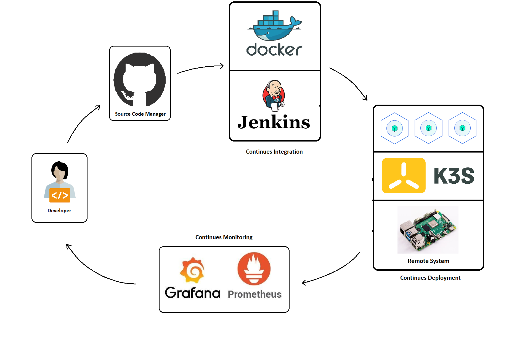

# IoT application development using DevOps assembly lines

## Gist About the Project:  

In this project, a home automation IoT application developed using an Architecture that is developed using DevOps tools to build, test, deploy, and monitor the IoT application.

The architecture consists of 5 stages. In the first stage, the developer creates the code of the application and pushes it to the Github repository. In the second stage, GitHub creates a webhook for the repository. In the third stage Jenkins job pulls the repository from the GitHub, builds the docker image of the application so that it can be deployed on the IoT device, and pushes the docker image to the docker hub. After pushing the docker image another job executes the k3s script that will download the container image from the docker hub and deploy it on the k3s container orchestration tool in RaspberryPi. In the fourth stage container will start the application and start the Prometheus node_exporter to export the metrics of the IoT device to the remote Prometheus database. In the fifth stage, collected metrics by prometheus is visualized by a visualization tool Grafana for monitoring the performance of our IoT devices in order to improve its performance.
 
Finally, a continuous IoT application development cycle is created that is enhancing the performance of the IoT application.
 
## Technologies Used 
Programming language:
-	Python
-	HTML
Source Code Management tool:
-	Git
-	Github
CI/CD tool:
-	Jenkins
Containerization tool:
-	Docker
Container Orchestration tool:
-	K3s
Monitoring tool:
-	Prometheus
Visualization tool:
-	Grafana
